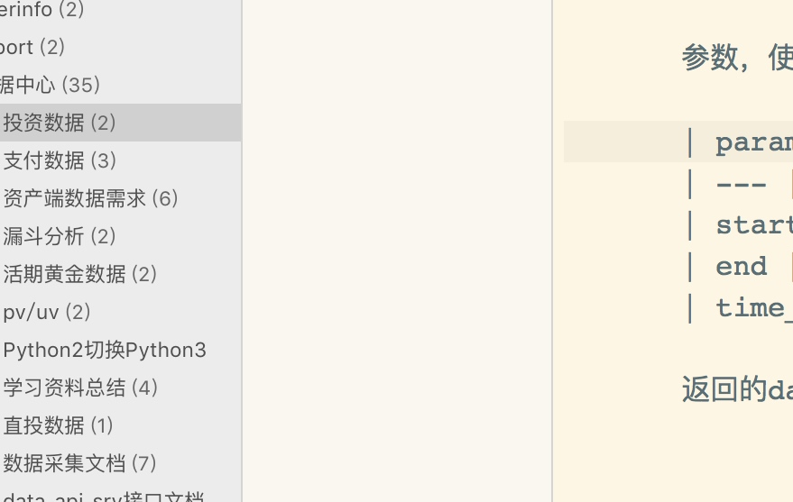

Title: 使用 SQLAlchemy 创建DB连接池
Date: 2017-11-02 17:59

# 使用 SQLAlchemy 创建DB连接池

工作中会经常用到经常使用到数据库的连接

**config.py**

```python
db_config_dict = {
    "drivername": "mysql+pymysql",
    "host": "localhost",
    "port": 3306,
    "database": "database",
    "username": "user",
    "password": "passwd",
    "query": {"charset": "utf8"}
}
```

**main.py**

```python
from config import db_config_dict
from sqlalchemy import create_engine
from sqlalchemy.orm import sessionmaker
from sqlalchemy.engine.url import URL

class DatabaseConnect(object):
    def __init__(self, db_config_dict):
        self.__config = db_config_dict
        self.POOL_RECYCLE = 7200
        self.POOL_SIZE = 10
        self.MAX_OVERFLOW = 20
        self.POOL_TIMEOUT = 30
        url = URL(**self.__config)
        print(url)
        self.Engine = create_engine(url,
                                    pool_size=self.POOL_SIZE,
                                    max_overflow=self.MAX_OVERFLOW,
                                    pool_timeout=self.POOL_TIMEOUT,
                                    pool_recycle=self.POOL_RECYCLE)

    def get_conn(self):
        return self.Engine.connect()
```





